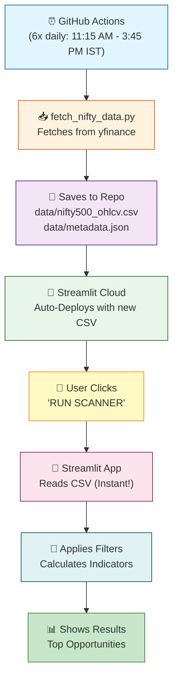
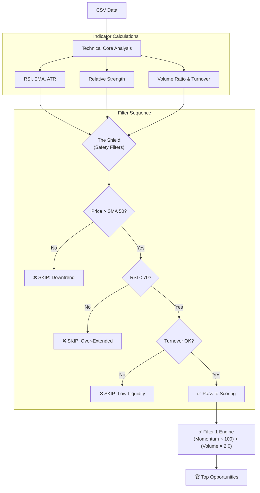

# 💎 Alpha-Zeta: The 2025 Champion Momentum Engine

The Alpha-Zeta Super Scanner is a professional-grade momentum engine designed specifically for the 2025 Nifty 500 market. It uses an audited **Filter 1** logic that prioritizes institutional volume and trend-velocity over complex, overfitted AI models.

**Now with Modern Streamlit UI + Automated Data Pipeline!** 🚀

---

## 🏛️ System Architecture

The scanner operates on an **Automated data pipeline** with instant CSV-based analysis. No more waiting for API calls—all 500 stocks are pre-fetched and ready.

### End-to-End Data Flow



### Technical Analysis Pipeline



---

## 🚀 Key Features

### 1. **Automated Data Pipeline** (NEW!)
- **Auto-fetch**: Data fetched 6 times daily (11:15 AM - 3:45 PM IST, Mon-Fri)
- **Lightning Fast**: Reads from CSV instead of 500 API calls
- **Consistent Data**: All users see identical prices (no yfinance lag)
- **Fallback**: Gracefully falls back to live yfinance if CSV unavailable

### 2. **Modern Streamlit Dashboard**
- **Interactive Sidebar**: Tweak capital, timeframe, and filters
- **Live Progress**: Watch the scan in real-time
- **Data Freshness Indicator**: Shows when data was last fetched
- **CSV Download**: One-click export

### 3. **Timeframe-Aware Logic**
Choose your weapon:
- **3-7 Days (Aggressive)**: Quick scalps/swings (**Min Turnover: 500M**)
- **1-2 Weeks (Recommended)**: Standard swing trades (**Min Turnover: 100-300M**)
- **1 Month (Conservative)**: Position trading (**Min Turnover: 100M**)

### 4. **Intelligent Position Sizing**
- **Input**: Total capital (e.g., ₹1,00,000)
- **Output**: Exact `Qty` (shares) to buy per stock
- **Rule**: Auto-limits to 10% allocation per stock

### 5. **Turnover-Based Volume Filter** (Institutional Standard)
- **Not** "Share Volume" (misleading)
- **Uses**: Turnover = Price × Volume (INR)
- **Why**: A ₹10 stock with 1M volume (₹1cr turnover) is less liquid than a ₹25,000 stock with 400 volume (₹1cr turnover)

---

## 📖 How to Use

### Step 1: Deploy (One-Time Setup)
```bash
# Local testing (optional)
python scripts/fetch_nifty_data.py
streamlit run streamlit_app.py

# Deploy to GitHub
git add .
git commit -m "Deploy Alpha-Zeta Scanner"
git push origin main

# Trigger first data fetch
Go to GitHub Actions → "Fetch Nifty 500 Data" → "Run workflow"
```

### Step 2: Run the Scanner
1. Open the Streamlit app (local or deployed)
2. **Sidebar Settings**:
   - **Timeframe**: Select based on your strategy (Recommended: 1-2 Weeks)
   - **Capital**: Enter your trading capital
   - **Min Volume**: Set turnover threshold (100-500 Million INR)
   - **Filter Mode**: Choose Turbo (aggressive) or Safe (defensive)
3. Click **"RUN SCANNER"**

### Step 3: Interpret Results
- **Data Source Indicator**: 
  - 📂 "Using high-speed pre-fetched data" = Fast, using Automated CSV storage (Delayed by 1 day for stability)
  - ⚠️ "Using live yfinance" = Slower, fallback mode
- **Data Last Updated**: Shows when data was fetched (IST timestamp)
- **Top Opportunities Table**: Sorted by Score (highest = best)

**Columns Explained:**
| Column | Description |
|--------|-------------|
| **Symbol** | Stock ticker |
| **Score** | Alpha-Zeta momentum score (higher = stronger) |
| **Spot Price** | Current market price |
| **Entry** | Recommended entry price |
| **Qty** | Number of shares to buy (based on your capital) |
| **RSI** | Relative Strength Index (avoid if > 70) |
| **ROC_20** | 20-day rate of change (%) |
| **Target** | Profit-taking price |
| **SL** | Stop Loss price |

---

## ⏰ Execution Strategy: The "3:15 PM Rule"

**CRITICAL:** Do NOT run this scanner at 9:15 AM.

| Time | Action | Why? |
| :--- | :--- | :--- |
| **9:15 - 10:00 AM** | 🛑 **WAIT** | **The Fake-Out Zone.** Institutions gap stocks to sell into retail. Data is noisy. |
| **12:00 PM** | ⚠️ **MONITOR** | Trend forming, but reversal still possible. |
| **3:15 PM - 3:25 PM** | ✅ **RUN & ENTER** | **The Truth Zone.** Institutions hold overnight here. 95% confirmed data. |
| **After Market** | 📝 **PLAN** | Build watchlist for next day (buy if price sustains > Entry). |

---

## 🛡️ The Shield: Safety Filters

1. **Trend Filter**: Price > SMA 50 (Never catches a falling knife)
2. **Exhaustion Filter**: RSI < 70 (Avoids buying tops)
3. **Turnover Filter**: Ensures institutional liquidity
4. **Cooling Filter** (Safe Mode): Prevents chasing parabolic moves

---

## 🧠 The Logic: "Filter 1" Engine

**Scoring Formula:**
```
Score = (Momentum_20 × 100) + (Volume_Intensity × 2.0)
```

**Why Filter 1?**
- **Momentum (33%)**: Ensures the stock is already moving up
- **Volume (66%)**: 2x weighted—the "Institutional Footprint"
- **Result**: A move without volume = trap. A move with massive volume = trend.

**Backtest Performance (2024):** +32.8% ROI on 1-2 week timeframe

---

## 🔄 GitHub Actions Workflow

The system auto-fetches data **6 times daily** during market hours:

| Time (IST) | Purpose |
|-----------|---------|
| 11:15 AM | Early market scan |
| 12:15 PM | Mid-morning update |
| 1:15 PM | Lunch hour check |
| 2:15 PM | Afternoon momentum |
| 3:15 PM | Near-close strength |
| 3:45 PM | Final EOD data |

**Files Generated:**
- `data/nifty500_ohlcv.csv` (~50-100 MB): Full OHLCV data for 500 stocks
- `data/metadata.json` (< 1 KB): Fetch timestamp and stats

**Monitoring:**
Check workflow status: `https://github.com/[your-repo]/actions`

---

## 📚 Understanding "Min Volume (Turnover)"

**IMPORTANT:** This is NOT "number of shares traded."

### What is Turnover?
```
Turnover = Stock Price × Volume Traded
```

### Example:
- **Stock A**: Price ₹10, Volume 10M shares → **Turnover = ₹100M**
- **Stock B**: Price ₹5000, Volume 20K shares → **Turnover = ₹100M**

Both have **equal liquidity** despite very different share volumes.

### Recommended Settings:
- **Aggressive (3-7 days)**: 500 Million INR (high liquidity for quick exits)
- **Standard (1-2 weeks)**: 100-300 Million INR
- **Conservative (1 month)**: 50-100 Million INR

---

## ⚙️ File Structure

```
Alpha_Zeta_Super_Scanner/
├── .github/workflows/
│   └── fetch_nifty_data.yml       # Auto-fetch workflow
├── data/
│   ├── nifty500_ohlcv.csv         # Pre-fetched stock data
│   └── metadata.json              # Data freshness info
├── scripts/
│   └── fetch_nifty_data.py        # Data fetch script
├── streamlit_app.py               # Main Streamlit app
├── app.py                         # Legacy CLI version
└── README.md                      # You are here
```

---

## 🚨 Troubleshooting

### Issue: "CSV data not found" warning
**Solution**: Manually trigger GitHub Actions workflow

### Issue: Old data showing
**Check**: `data/metadata.json` → `last_updated` field  
**Solution**: Wait for next scheduled run or trigger manually

### Issue: Workflow fails
**Cause**: NSE website timeout (common)  
**Fix**: Automatic retry at next scheduled time

---

## 📊 Performance Notes

- **Before Pipeline**: 500 API calls × 10 sec = 80+ minutes per scan
- **After Pipeline**: Instant CSV read < 1 second
- **Reliability**: Works even if yfinance is down (uses last good data)
- **GitHub Actions Quota**: 2000 min/month free (you use ~360 min/month)

---

> [!IMPORTANT]
> This scanner is designed for **Momentum Breakouts**. It performs best when the sector is bullish. **Always respect the Stop Loss!**

---

## 🔄 Strategy Longevity & Adaptation

No strategy is truly "eternal" without adaptation. Alpha-Zeta is designed with **Self-Correction** and **Market-Awareness** to prevent obsolescence.

### 1. **Self-Correcting (Adaptive Weighting)**
The system learns from its own trades. After logging sufficient trade data (via the Zeta Aleph engine), it runs a small ML model (`LogisticRegression`) on its history to see which formulas are currently working and adjusts their weights:
- **Bull Market**: Weights "Velocity" (F1) higher for explosive gains.
- **Sideways Market**: Shifts weight to "Mean Reversion" (F5/F6) for safety.

### 2. **Daily Refinement**
You don't need to change the code daily; the **Scanner** does it for you:
- Fetches fresh OHLCV data from the NSE 6x daily.
- Recalculates **SMA 50** and **EMA** guards instantly.
- If a stock's trend breaks, it is removed from the list in real-time.

### 3. **Market Regime Protection**
The system uses a **Gaussian Hidden Markov Model (HMM)** to detect the "Market Regime" (Bull/Bear/Chaos):
- **Safety Net**: If the market turns "Bearish" or "Chaotic," the scanner will return "No valid results found."
- **Capital Preservation**: Protects your money until the market becomes favorable again.

---

> [!TIP]
> **Pro Tip:** Every 3-6 months, run the `v10_optimizer.py` script. This will "Retrain" the Random Forest model on the most recent 1-2 years of price action to ensures the weights are perfectly dialed in for the latest market cycle.

---

## 📜 License & Disclaimer

This tool is for educational and research purposes. Trading in equities involves risk. Past performance does not guarantee future returns. The author is not responsible for any financial losses.

---

**Made with ⚡ by Pravin A Mathew**  
**Powered by GitHub Actions, Streamlit & yfinance**
