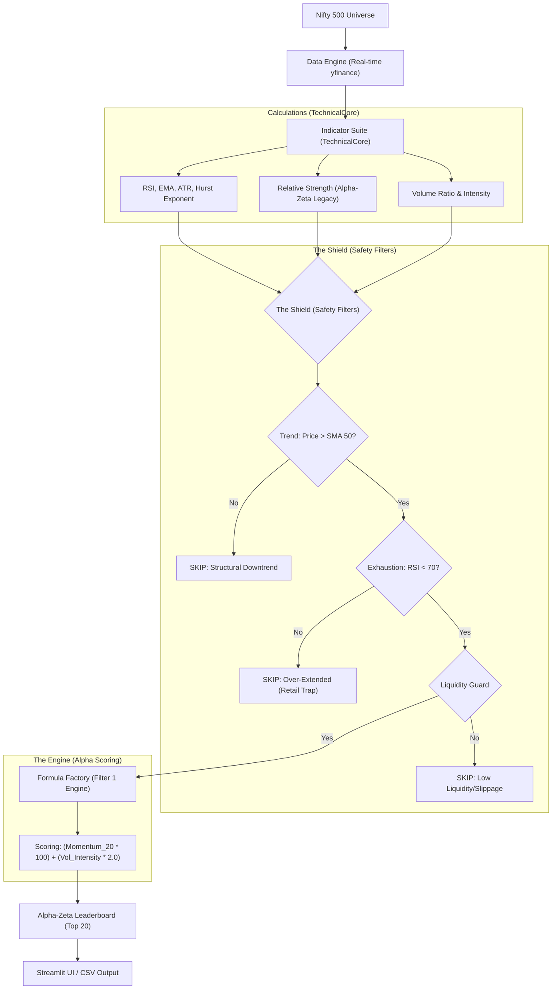
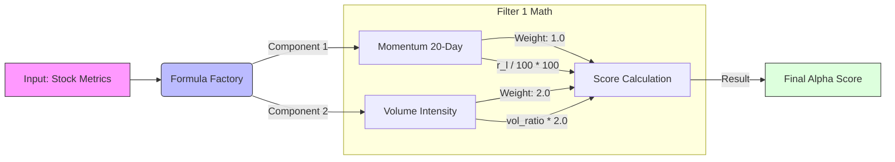

# 💎 Alpha-Zeta: The 2025 Champion Momentum Engine

The Alpha-Zeta Super Scanner is a professional-grade momentum engine designed specifically for the 2025 Nifty 500 market. It uses an audited **Filter 1** logic that prioritizes institutional volume and trend-velocity over complex, overfitted AI models.

**Now with a Modern Streamlit UI!** 🚀

---

## 🏛️ System Architecture

The scanner operates on a **Defensive Momentum** pipeline. It doesn't just find "what is going up"—it finds "what is sustainable."



---

## 🧠 The Logic: "Formula Factory" & Filter 1

The core of the scanner is the **Filter 1** logic, which won our 2025 backtesting gauntlet with a **+32.8% ROI**.



### Why Filter 1?
*   **Momentum (33% Weight):** Ensures the stock is already moving up. We don't guess bottoms.
*   **Volume (66% Weight):** The *Volume Intensity* is weighted **2x**. This is the "Institutional Footprint." A move *without* volume is a trap. A move *with* massive volume is a trend.

---

## 🚀 Key Features

### 1. The Streamlit Dashboard (NEW!)
We have upgraded from a pure CLI tool to a full web dashboard.
*   **Interactive Sidebar:** Tweak settings (Capital, Timeframe, Filters) on the fly.
*   **Live Scanning:** Watch the progress bar as it scans the Nifty 500.
*   **Visual Dataframe:** Sortable, clean results table.
*   **CSV Download:** One-click export for your records.

### 2. Timeframe-Aware Logic
Choose your weapon based on your trading style:
- **Scalper (3-7 Days):** Aggressive, high-speed momentum.
- **Champion (1-2 Weeks):** The "Audited Winner" for standard swing trades.
- **Swing (1 Month):** Stable, long-form trend following.

### 3. Intelligent Position Sizing
The scanner includes a **Capital Management** engine.
- **How it works:** Input your `Total Capital` (e.g., ₹1,00,000).
- **Rule:** The system automatically limits risk to **10% allocation per stock**.
- **Output:** It calculates the exact **Qty** (Shares) to buy.
    - *Note:* This does NOT hide stocks. If a stock is too expensive for your allocation, it shows `Qty: 0` but still lists the opportunity.

---

## 📖 How to Use

### Step 1: Run the App
Open your terminal and run:
```bash
streamlit run streamlit_app.py
```
*(The legacy `python app.py` CLI is still available if you prefer the terminal)*

### Step 2: Configure & Scan
1.  **Sidebar:** Select your **Timeframe** (Recommended: *1-2 Weeks*).
2.  **Capital:** Enter your trading capital to get accurate `Qty` sizing.
3.  **Click RUN:** The engine will process ~500 stocks in real-time.

### Step 3: View & Act
*   Look for the **Top 5 stocks** (highest scores).
*   Check the **RSI** (should be < 70).
*   Use the **Entry**, **Target**, and **SL** (Stop Loss) levels provided.

---

## ⏰ Execution Strategy: The "3:15 PM Rule"

**CRITICAL:** Do NOT run this scanner at 9:15 AM.

| Time | Action | Why? |
| :--- | :--- | :--- |
| **9:15 - 10:00 AM** | 🛑 **WAIT** | **The Fake-Out Zone.** Institutions often gap stocks up to sell into retail liquidity. Data is noisy and unreliable. |
| **12:00 PM** | ⚠️ **MONITOR** | Trend is forming, but reversal is still possible. |
| **3:15 PM - 3:25 PM** | ✅ **RUN & ENTER** | **The Truth Zone.** If a stock is strong here, institutions are holding it overnight. The closing data is 95% confirmed. |
| **After Market** | 📝 **PLAN** | Run the scanner to build your watchlist for the next morning (Buy if price sustains > Entry). |

**Why 3:15 is superior to 9:15:**
The Technical Core indicators (RSI, SMA, ROC) are designed for **Daily Closing** data. A 9:15 AM "Close" is barely a minute old and statistically insignificant. 3:15 PM represents the true "Voice of the Market."

---

## 📚 Glossary of Metrics

| Metric | Description | Role in Strategy |
| :--- | :--- | :--- |
| **Score** | The Alpha-Zeta Ensemble score. | Determines overall rank. High score = High conviction. |
| **RSI** | Relative Strength Index (14). | **Exhaustion Guard.** Skips stocks > 70 to avoid buying tops. |
| **ROC_20** | 20-Day Rate of Change (%). | **The Velocity Engine.** Measures the speed of the current trend. |
| **Target** | Automated profit-taking price. | Goal: ~5% gain in 1-2 weeks (Champion mode). |
| **SL** | Automated Stop Loss price. | Protections: ~4% below entry to minimize risk. |

---

## 🛡️ Safeguards
*   **SMA 50:** Never buys a falling knife.
*   **RSI 70:** Never buys the blow-off top.
*   **ATR:** Position sizing and SL are adjusted for volatility.

---
> [!IMPORTANT]
> This scanner is designed for **Momentum Breakouts**. It performs best when the specific stock sector is also bullish. Always respect the Stop Loss!
